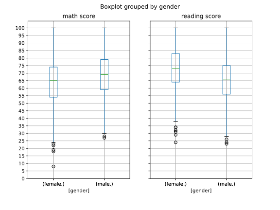

# Results from Data Analysis on Students Performance

## Gender Boxplot (math vs reading score)
Question: Are there gender differences in math vs reading?

Based on the boxplots above, we observe that on average males be