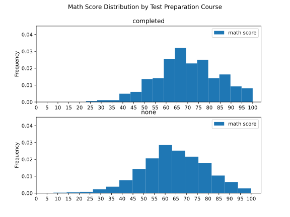
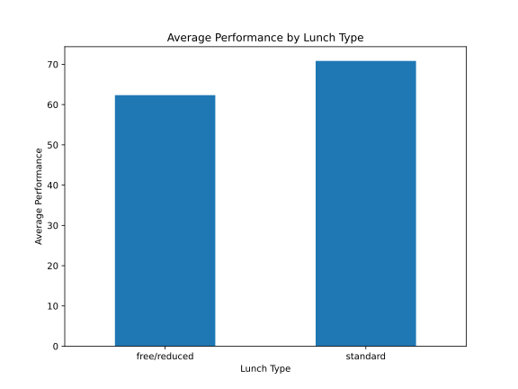
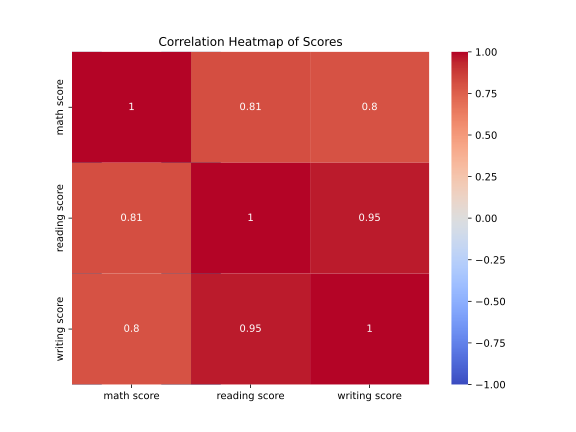
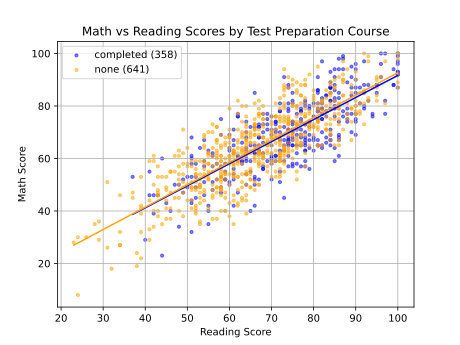

# Results from Data Analysis on Students Performance

## 1. Gender Boxplot (math vs reading score)
Question: Are there gender differences in math vs reading?

Based on the boxplots above, we observe that on average males perform better on math scores while females perform better on reading scores. We also observe that females have a much larger spread of math scores than males, while males have a much larger spread of reading scores than females. Females also displayed the largest change between math and reading scores by about 8 points, while the difference between males scores was about 3 points.

## 2. Test prep impact on math
Question: Do students who completed test prep score higher in math?

## 3. Lunch type and average performance
Question: Does lunch type (standard vs free/reduced) relate to outcomes?

## 4. Subject correlations
Question: How strongly do the three subjects move together?

## 5. Math vs reading with trend lines by test prep
Question: How strongly are math and reading scores associated, and do students who completed the test‑preparation course have a _different slope_ in the math–reading relationship than those who did not?

