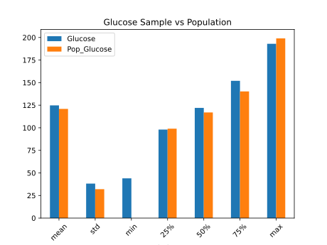
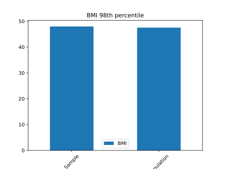
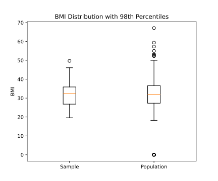
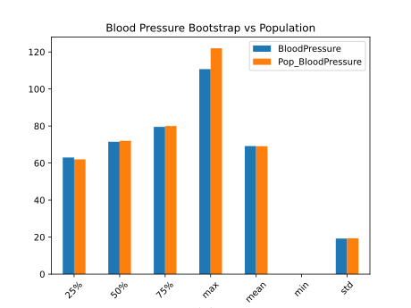

# Diabetes Data Analysis

- [Raw Data](../raw_data/diabetes.csv)
- [Clean Data](../clean_data/clean_diabetes.csv)
- [Source Code](../src/process.ipynb)

# A) Glucose Population vs Random Sample
Based on the chart and table below, we can see that using a random sample of 25 observations, our mean is off by 4 and our max is off by 6.

<table border="1" class="dataframe">
  <thead>
    <tr style="text-align: right;">
      <th></th>
      <th>index</th>
      <th>Glucose</th>
      <th>Pop_Glucose</th>
    </tr>
  </thead>
  <tbody>
    <tr>
      <th>0</th>
      <td>count</td>
      <td>25.000</td>
      <td>768.000000</td>
    </tr>
    <tr>
      <th>1</th>
      <td>mean</td>
      <td>124.800</td>
      <td>120.894531</td>
    </tr>
    <tr>
      <th>2</th>
      <td>std</td>
      <td>38.139</td>
      <td>31.972618</td>
    </tr>
    <tr>
      <th>3</th>
      <td>min</td>
      <td>44.000</td>
      <td>0.000000</td>
    </tr>
    <tr>
      <th>4</th>
      <td>25%</td>
      <td>98.000</td>
      <td>99.000000</td>
    </tr>
    <tr>
      <th>5</th>
      <td>50%</td>
      <td>122.000</td>
      <td>117.000000</td>
    </tr>
    <tr>
      <th>6</th>
      <td>75%</td>
      <td>152.000</td>
      <td>140.250000</td>
    </tr>
    <tr>
      <th>7</th>
      <td>max</td>
      <td>193.000</td>
      <td>199.000000</td>
    </tr>
  </tbody>
</table>

# B) BMI Sample vs Population
Based on the charts below, we can see that the 98th percentiles are extremely close to each other, but there is a lot of data and outliers that are not captured in the sample. 

# C) Blood Pressure Bootstrap vs Population
Based on the chart and table below, we observe that bootstrap is an effective way at estimating population characteristics, with the values being significantly closer when compared to the glucose test. 

<table border="1" class="dataframe">
  <thead>
    <tr style="text-align: right;">
      <th></th>
      <th>BloodPressure</th>
      <th>Pop_BloodPressure</th>
    </tr>
    <tr>
      <th>index</th>
      <th></th>
      <th></th>
    </tr>
  </thead>
  <tbody>
    <tr>
      <th>25%</th>
      <td>63.012500</td>
      <td>62.000000</td>
    </tr>
    <tr>
      <th>50%</th>
      <td>71.485000</td>
      <td>72.000000</td>
    </tr>
    <tr>
      <th>75%</th>
      <td>79.512000</td>
      <td>80.000000</td>
    </tr>
    <tr>
      <th>count</th>
      <td>150.000000</td>
      <td>768.000000</td>
    </tr>
    <tr>
      <th>max</th>
      <td>110.748000</td>
      <td>122.000000</td>
    </tr>
    <tr>
      <th>mean</th>
      <td>69.171987</td>
      <td>69.105469</td>
    </tr>
    <tr>
      <th>min</th>
      <td>0.000000</td>
      <td>0.000000</td>
    </tr>
    <tr>
      <th>std</th>
      <td>19.202760</td>
      <td>19.355807</td>
    </tr>
  </tbody>
</table>

